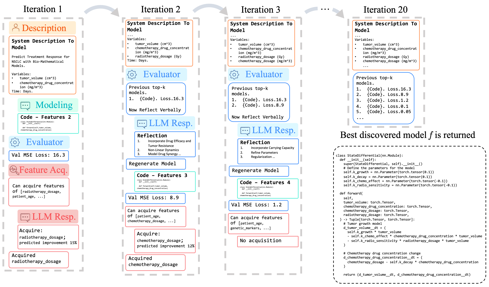

# [NeurIPS 2024] Data-Driven Discovery of Dynamical Systems in Pharmacology using Large Language Models

[](https://openreview.net/forum?id=KIrZmlTA92)
[](https://opensource.org/licenses/MIT)
[](https://github.com/psf/black)

This repo holds the code for [Data-Driven Discovery of Dynamical Systems in Pharmacology using Large Language Models](https://openreview.net/forum?id=KIrZmlTA92).


#### Introduction

The discovery of dynamical systems is crucial across a range of fields, including pharmacology, epidemiology, and physical sciences. Accurate and interpretable modeling of these systems is essential for understanding complex temporal processes, optimizing interventions, and minimizing adverse effects. In pharmacology, for example, precise modeling of drug dynamics is vital to maximize therapeutic efficacy while minimizing patient harm, as in chemotherapy. However, current models, often developed by human experts, are limited by high cost, lack of scalability, and restriction to existing human knowledge. In this paper, we present the Data-Driven Discovery (D3) framework, a novel approach leveraging Large Language Models (LLMs) to iteratively discover and refine interpretable models of dynamical systems, demonstrated here with pharmacological applications. Unlike traditional methods, D3 enables the LLM to propose, acquire, and integrate new features, validate, and compare dynamical systems models, uncovering new insights into pharmacokinetics. Experiments on a pharmacokinetic Warfarin dataset reveal that D3 identifies a new plausible model that is well-fitting, highlighting its potential for precision dosing in clinical applications.




#### Setup

To get started:

1. Clone this repo
```bash
git clone https://github.com/samholt/DataDrivenDiscovery && cd ./DataDrivenDiscovery
```

2. Follow the installation instructions in `setup/install.sh` to install the required packages.
```bash
./setup/install.sh
```

#### Replicating the main results

In the main terminal, perform the following steps:
1. Modify the configuration files in folder `config`. The main config file that specifies baselines, datasets and other run parameters is in `config/config.yaml`
2. Run `python run.py` to run all baselines on all datasets. This will generate a log file in the `logs` folder.
2. Once a run has completed, process the log file generated output into the `logs` folder, with the script `process_result_file.py`. Note, you will need to edit the `process_result_file.py` to read this generated log file, i.e., specify the path variable of where it is. This will generate the main tables as presented in the paper.


### Cite

If you use our work in your research, please cite:

```bibtex
@inproceedings{
    holt2024datadriven,
    title={Data-Driven Discovery of Dynamical Systems in Pharmacology using Large Language Models},
    author={Samuel Holt and Zhaozhi Qian and Tennison Liu and Jim Weatherall and Mihaela van der Schaar},
    booktitle={The Thirty-eighth Annual Conference on Neural Information Processing Systems},
    year={2024},
    url={https://openreview.net/forum?id=KIrZmlTA92}
}
```